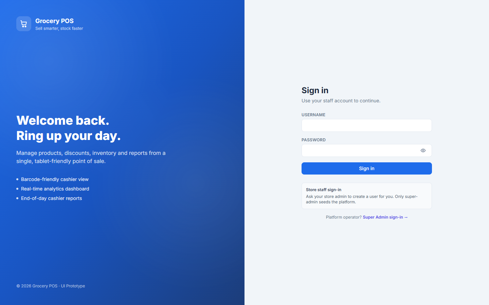

# MyLab — User Manual

Practical, end-to-end walkthrough of the MyLab SPA for the four people who
use it every day:

1. **Medtech / Encoder** — encodes results and signs as medtech.
2. **Cashier** — collects payment and closes arrangements.
3. **Lab admin / Manager** — everything the medtech + cashier can do plus
   catalog, staff, doctors, and subscription management. Signs as
   pathologist if licensed.
4. **Platform super admin** — provisions tenants, curates subscription
   plans, approves payments, manages platform staff.

> **About the screenshots**: image placeholders reference files in
> `docs/screenshots/`. Drop captures there using the naming convention in
> `docs/screenshots/README.md`. Until you do, each `` renders as the
> alt text — the manual still reads cleanly.

## Table of Contents

- [Getting started](#getting-started)
- [Part 1 — Tenant console](#part-1--tenant-console)
  - [1.1 Signing in](#11-signing-in)
  - [1.2 Welcome & Setup Readiness](#12-welcome--setup-readiness)
  - [1.3 Dashboard](#13-dashboard)
  - [1.4 Patients](#14-patients)
  - [1.5 Patient Cases](#15-patient-cases)
  - [1.6 Cashier](#16-cashier)
  - [1.7 Laboratory (result encoding & signing)](#17-laboratory-result-encoding--signing)
  - [1.8 Test Items (catalog)](#18-test-items-catalog)
  - [1.9 Item Categories](#19-item-categories)
  - [1.10 Item Groups](#110-item-groups)
  - [1.11 Item Packages](#111-item-packages)
  - [1.12 Discounts](#112-discounts)
  - [1.13 Expenses](#113-expenses)
  - [1.14 Users](#114-users)
  - [1.15 Doctors](#115-doctors)
  - [1.16 Store Settings (branding + templates)](#116-store-settings-branding--templates)
  - [1.17 Subscription](#117-subscription)
  - [1.18 Reports](#118-reports)
  - [1.19 Change your own password](#119-change-your-own-password)
- [Part 2 — Public views](#part-2--public-views)
  - [2.1 Public lab report (QR link)](#21-public-lab-report-qr-link)
  - [2.2 Registration & verification](#22-registration--verification)
- [Part 3 — Platform console (super admin)](#part-3--platform-console-super-admin)
  - [3.1 Signing in](#31-signing-in)
  - [3.2 Platform dashboard](#32-platform-dashboard)
  - [3.3 Tenants](#33-tenants)
  - [3.4 Subscription plans](#34-subscription-plans)
  - [3.5 Subscription payments (approve / reject)](#35-subscription-payments-approve--reject)
  - [3.6 Tenant users (cross-tenant view)](#36-tenant-users-cross-tenant-view)
  - [3.7 Super admin users](#37-super-admin-users)
  - [3.8 Platform reports](#38-platform-reports)
  - [3.9 Change your own password](#39-change-your-own-password)
- [Reference](#reference)
  - [Roles at a glance](#roles-at-a-glance)
  - [Payment methods reference](#payment-methods-reference)
  - [Result types reference](#result-types-reference)
  - [Troubleshooting](#troubleshooting)

---

## Getting started

**Where to open the app.** In development, the tenant console is at
`http://localhost:5173/` and the platform console is at
`http://localhost:5173/super/login`. In production, replace
`localhost:5173` with the deployed origin
(e.g. `https://mylab.edgetechph.net`).

**What you'll need before your first sign-in.**

| You are | You need |
|---|---|
| Medtech / cashier / manager | A username and password issued by your lab admin, and the tenant your lab belongs to must be **Active**. |
| Lab admin / owner | Same as above; the seed admin account issued when you registered. |
| Super admin | A super-admin username issued by the platform owner. |

**Session basics.** Once you sign in, your token is remembered in this
browser until you sign out or your session expires (server-driven). If the
API rejects your token at any point (a "session expired" banner appears on
the login page), sign back in.

The tenant console and platform console keep **separate sessions**, so a
super admin can be signed into both at the same time in the same browser.

---

## Part 1 — Tenant console

### 1.1 Signing in

1. Open the root URL and click **Sign in** (or hit `/login` directly).
2. Enter your **Username** and **Password**.
3. Click the eye icon to peek at your password if you need to check for
   typos.
4. Click **Sign in**.

If your credentials are wrong you'll see "Invalid username or password."
If your account was deactivated, you'll see "Your account is inactive." —
contact your lab admin.

**Session expired?** If you're bounced back to the login page with "Your
session has expired — please sign in again", just enter your credentials
once more. The URL you were on before will re-open after login.

---

### 1.2 Welcome & Setup Readiness

You land on **Welcome** (`/home`) after every sign-in. It's a curated set
of quick-launch tiles based on what your account can access.

**Setup Readiness** (`/setup-readiness`) is a one-time onboarding
checklist that shows how far you've gone with initial configuration.
Every unchecked item deep-links to the screen that resolves it:

- Change temporary password
- Upload lab logo + fill address
- Import pre-loaded catalog
- Add at least one doctor (medtech + pathologist)
- Create your first non-admin user
- Register your first patient
- Open your first case

Once every step is green, MyLab tucks the tile away — you can still
revisit `/setup-readiness` any time from the sidebar.

---

### 1.3 Dashboard

The main KPI screen. Choose a date range (**Today / 7 days / 30 days /
MTD / YTD**, or a custom pair) and MyLab renders:

- **Revenue summary** — total, paid, pending, void.
- **Revenue trend** — line chart across the range.
- **Method breakdown** — donut chart of cash vs e-wallet vs bank vs A/R
  vs insurance vs other.
- **Receivables aging** — how much money is still owed (A/R + insurance),
  bucketed by age.
- **Throughput** — patients + cases + requisitions + reports processed.
- **Top items** — best-selling tests / packages.
- **Profitability** — margin per test using the expense side against
  sales.

Dashboard access itself is a permission — a cashier account might see the
top-line revenue but not profitability, depending on how the manager
configured **Assign access**.

---

### 1.4 Patients

Patient master. Every human MyLab processes lives here.

- **Search** by MRN, name, contact number, or national ID.
- **+ Add Patient** — the form runs a **duplicate check** on first + last
  + birthdate as you type. If MyLab thinks the person is already in the
  system, it shows a candidate list; picking one takes you to that
  patient's detail instead of creating a duplicate.
- **Fields**: sex, birthdate, civil status, blood type (optional),
  address, contact number, national IDs (SSS / PhilHealth / TIN /
  driver's licence).
- **MRN**: auto-generated as `P-NNNNNN`, unique per tenant.

**Row actions** (three-dot menu):

- **View** — patient detail with a list of all their cases.
- **Edit** — update demographics.
- **Set status** — Active / Inactive. Inactive patients stay in the
  database (case history preserved) but don't appear in search-first
  lookups.
- **Delete** — hard delete. Only allowed when the patient has no cases
  (you'll get a rejection message otherwise).

---

### 1.5 Patient Cases

A **case** is a single visit (encounter). It groups requisitions,
payments, and lab reports for that visit.

- **+ Add Case** — pick a patient (search box shows MRN + name +
  birthdate), set case type (**walk-in / follow-up / corporate /
  pre-employment / insurance / other**), case date, and referring doctor
  (optional).
- The case detail page has three sub-tabs:
  - **Requisitions** — line items ordered on this visit. Add more,
    finalise draft ones, or void.
  - **Payments** — payment records against this case.
  - **Lab reports** — encoded / finalised / voided reports.

**Requisitions inside the case:**

- **+ Add Requisition** opens a picker where you tick test items or drop
  in an item package. Packages expand into their constituent tests but
  the bundle price applies.
- **Discount** — apply a percent or fixed peso discount at the
  requisition level (a discount code from **Discounts**, if you set one
  up).
- **Finalize** — locks the requisition so the cashier can accept payment.
  You can still void a finalised requisition (with reason).
- Requisition number auto-generated as `R-NNNNNN`, unique per tenant.

---

### 1.6 Cashier

Payment collection lives here. Two entry points:

1. Click **Pay** on a finalised requisition inside the case.
2. Open **Cashier** from the sidebar → the **Unpaid Requisitions** list
   shows every finalised requisition waiting for payment across all
   cases.

**Payment form:**

- Pick which requisition items are being paid this transaction (partial
  payments are allowed).
- Pick a **payment method** — see [Payment methods reference](#payment-methods-reference)
  below.
- For channeled methods (e-wallet / bank transfer), enter the **payer
  channel** (e.g. GCash Personal) and **reference number**.
- For **arrangements** (A/R / insurance), the requisition is marked as
  paid immediately so results can be released; money settles later. Close
  the arrangement with **Resolve arrangement** on the payment record.

**Void a payment:**

- Row action → **Void**. You'll be prompted for a manager's username +
  password (`POST /auth/verify-manager`) and a reason.
- The void is logged in the **Voids Report** with the authoriser's name.

**Receipt:**

- After a successful payment, MyLab renders a receipt in the browser you
  can print or save.
- Receipt copy comes from **Store Settings** — either the auto-generated
  block plus your header/footer text, or fully custom multi-line copy.

---

### 1.7 Laboratory (result encoding & signing)

Where medtechs encode results and where reports are signed and finalized.

**Eligible requisitions:**

The list on the left shows every **paid** requisition that still has
uncovered test lines — click one and MyLab drops you into the encoding
view.

**Encoding results by type:**

- **Single** — one numeric or text value. Numeric values are
  auto-flagged **High / Low / Critical** if they fall outside the test
  item's reference range.
- **Panel** — a form with named fields (e.g. CBC: HGB, HCT, WBC, PLT,
  MCV, MCH, MCHC, RDW, differential percentages). Each field has its own
  reference range.
- **Narrative** — free-text write-up (histopath, radiology-style
  interpretation).
- **Culture** — culture + antibiotic sensitivity grid. Add organisms and
  mark each antibiotic as **S / I / R**.
- **Matrix** — arbitrary rows × columns for tests that don't fit any of
  the above.

Save as you go. MyLab auto-saves a draft — you can leave the encoding
view and come back to finish later.

**Signing & finalization:**

1. Sign as **medtech** — your licence number pre-fills from your doctor
   record if you have one.
2. Hand over (or switch users) for the **pathologist** signature.
3. Once both signatures are recorded, click **Set as Final**. MyLab:
   - Stamps the report as `Finalized` with the timestamp.
   - Generates a **QR code** that resolves to the public lab-report view
     (`/lab/view?uuid=…&t=…`).
4. **Print** — MyLab uses the print template + paper size configured on
   each test's **item category**. Different categories can print on
   completely different templates.

**Unfinalize / void:**

- Row action → **Unset final** if you need to fix a typo. Requires
  manager confirmation.
- Row action → **Void** if the report was wrong at the source (e.g.
  patient mix-up). Voided reports show in rose and are excluded from
  reports.

---

### 1.8 Test Items (catalog)

Individual lab tests live here.

- **Fields**: code (unique per tenant), name, item category (which drives
  print template + signatory), unit, result type, reference range, price,
  cost, active flag.
- **Result type** — pick one of the five (see [Result types reference](#result-types-reference)).
- **Panel components** — for `panel` type, add rows for each field
  (name, unit, reference range low/high, sequence).
- **Import** — bulk import via Excel/CSV using the pre-loaded catalog or
  your own file (see the **Import** button top-right).

**Search + filter** by group, category, result type, or active status.

---

### 1.9 Item Categories

Sub-categories under a group (e.g. Chemistry → Liver Function → AST).
Categories control **how the report prints**:

- **Print template** — chart-style / table-style / narrative-style — the
  frontend picks the right `LabReportPrintable` variant.
- **Paper size** — A4 / Letter / A5 / half-letter, etc.
- **Default signatory** — who should sign this category by default
  (a doctor from your registry).
- **Signatory role** — medtech and/or pathologist required.

---

### 1.10 Item Groups

Top of the catalog hierarchy (e.g. Chemistry, Hematology, Microscopy,
Serology, Microbiology).

- **+ Add Group** — create your own group.
- **Import pre-loaded catalog** — one-click imports the standard MyLab
  catalog into this tenant (5 groups, 20+ categories, hundreds of tests).
  Idempotent — running twice doesn't duplicate.

---

### 1.11 Item Packages

Bundle common panels into a package with a discounted price (e.g. `CBC +
Urinalysis + Fecalysis` for a routine check-up).

- **+ Add Package** — pick a code, name, price.
- **Items** — bulk-add test items and item packages (yes, packages can
  contain packages — they get flattened when added to a requisition).
- The requisition line shows the package name; the underlying tests are
  billed at the package price, not per-test.

---

### 1.12 Discounts

Reusable discount rules that the cashier and requisition-writer can
apply.

- **Fields**: code, name, type (**percent** or **fixed**), value, active
  flag.
- Apply at the requisition level from the case detail page (Discounts
  panel). The requisition recomputes total in one shot.

---

### 1.13 Expenses

Log lab operating expenses (reagents, consumables, utilities, rent,
salaries).

- **+ Add Expense** — date, category, amount, note. Optional receipt
  attachment.
- Default view is this month; widen the range or change the Status
  filter (Active / Void) to look further back.
- **Void** — soft-delete with a reason. The row stays visible so the
  audit trail is intact.

The **Expense Report** and **Profitability** dashboard widget both read
from here.

---

### 1.14 Users

Staff account management.

- **+ Add User** — username (unique per tenant), name, email, role
  (**admin / manager / cashier / medtech / staff**), temp password.
- **Row actions**:
  - **Assign access** — checkbox modal showing every navigation row from
    the access template. Tick what this user can open; save. Bounces
    happen client-side (sidebar filter + router guard) AND server-side
    (per-endpoint check).
  - **Change password** — dashboard reset (no old password required —
    manager override).
  - **Set status** — Active / Inactive.
  - **Delete** — hard delete.

Users cannot delete themselves, and only super admins can delete
super-admin accounts.

---

### 1.15 Doctors

Registry of pathologists and medtechs who can sign reports.

- **+ Add Doctor** — name, licence number, role (**Medtech** or
  **Pathologist**), e-signature image upload (PNG with transparent
  background works best).
- The e-signature prints on finalized reports above the name.
- **Default signatory per item category** — set from **Item Categories**;
  the encoder can override at finalize time.

---

### 1.16 Store Settings (branding + templates)

Everything that decides what your reports and receipts *look* like.

- **Lab identity** — name, legal name, owner, currency (₱).
- **Address** — up to 4 lines, plus phone and email. Printed on the
  report footer.
- **Tax & Registration** — TIN, VAT-registered flag, "show TIN on
  receipts" toggle.
- **Logo upload** — square PNG or JPG. Shows on sidebar, receipts, and
  (in Logo+Text header mode) the report header.
- **Lab report header mode**:
  - **Logo + text** — square logo on the left, lab identity block on the
    right.
  - **Full-width image** — one banner (upload) prints full-width; lab
    identity is hidden.
- **Receipt customization**:
  - **Header text / Footer text** — small lines above/below the
    auto-generated block.
  - **Custom header override** — replace the auto-generated block with
    your own multi-line copy.
  - **Custom footer override** — same for the footer.
- **Live preview** on the right shows what a receipt will look like as
  you type.

---

### 1.17 Subscription

Show current plan, expiry, and renew / upgrade.

- **Status block** — plan, amount, start, expiry, days remaining. Badge
  switches **Active / Expiring soon / Expired / No plan**.
- **Plan picker** — active plans grouped as **Trial** (free) and
  **Paid**. Trial plans are marked accordingly and typically only appear
  during onboarding.
- **Payment instructions (per plan)** — QR shown is the plan's
  `qrcode_for_payment` (uploaded by the super admin), else the env
  fallback. Cross-fades when you switch selection.
- **Submit Payment (manual)**:
  1. Upload a screenshot / photo of your receipt.
  2. MyLab's OCR (`POST /ai-extraction/receipt` — Tesseract on the
     backend) extracts amount, reference number, payment date, and
     payee account into the form.
  3. Review the auto-filled fields and edit if OCR was off.
  4. Submit — the payment goes to the super admin for approval.
- **Submit Payment (PayPal Smart Button)** — only appears when a PayPal
  client ID is configured for the frontend. Pay directly in the browser;
  the subscription activates automatically on capture (also validated
  server-side by webhook for redundancy).
- **Payment history** — table with Submitted / Plan / Amount Paid /
  Method / Reference / Status / Receipt (**View** opens a modal receipt
  viewer with zoom controls).

---

### 1.18 Reports

Twelve report screens, each with a date-range or year filter and CSV
export.

| Report | What it shows |
|---|---|
| **Summary** | Top-line KPIs and sparkline for the range. |
| **Monthly Sales** | Revenue by month (year filter). |
| **Monthly Tests** | Test count by month (year filter). |
| **Daily Sales** | Day-by-day revenue for reconciliation. |
| **Daily Tests** | Day-by-day test volume. |
| **Daily Detailed Sales** | Line-by-line — every payment, item, discount. |
| **Cashier Sales** | Per-cashier / per-method totals. |
| **Voids** | Voided payments with authoriser + reason. |
| **Discounts** | Discount activity (which fired, how often). |
| **Expenses** | Expense activity by category. |
| **Payment Summary** | Method split for the range. |
| **Test Analytics** | Volume by test, by category, and **TAT** (paid → finalized time distribution). |

Every table paginates client-side; **Export CSV** mirrors on-screen
columns.

---

### 1.19 Change your own password

Click your initials in the top-right → **Change password**.

- Enter your current password + new password (twice for confirmation).
- Submits to `PATCH /user/profile/change-password` (staff) or
  `PATCH /admin/profile/change-password` (super admin).

---

## Part 2 — Public views

### 2.1 Public lab report (QR link)

Every finalized report prints a **QR code**. Scanning it opens
`/lab/view?uuid=…&t=…` in the patient's browser — a read-only view of the
same report the lab printed, no login required.

The token (`t`) is HMAC-signed on the backend with `JWT_SECRET`. Anyone
can *view* the report with the link; nobody can *alter* it without
signing in as authorized staff.

Use case: patients can share the link with their doctor; the doctor
opens it, verifies it's a genuine MyLab report (URL + signatures + QR
integrity), and reads results without needing a MyLab account.

---

### 2.2 Registration & verification

Public tenant self-signup:

1. **`/register`** — RegisterView.vue. Enter lab name, contact email,
   contact number, owner name, city / province / country. Submit.
2. **`/register/verify`** — RegisterVerifyView.vue. Confirmation screen
   telling you to check your email.
3. Email contains a **Verify email** link → **`/verify?token=…`** →
   VerifyView.vue consumes the token and either bounces you to:
   - **`/welcome`** (RegisterVerifiedView.vue) on success — plus a second
     email arrives with your admin username + password.
   - **`/register/verify-failed`** (RegisterVerifyFailedView.vue) on
     failure (expired token, already-verified, etc.) with a resend link.

Rate-limited server-side to 5 attempts / minute per IP.

---

## Part 3 — Platform console (super admin)

### 3.1 Signing in

Open **`/super/login`** and sign in with your super-admin credentials.
The platform console lives entirely under `/super/*`; sessions don't
share tokens with the tenant console (different localStorage keys).

### 3.2 Platform dashboard

KPI screen for the platform owner:

- Tenant counts (total, active, trial, expired).
- Subscription revenue (this month, last month, YTD).
- Churn signals.
- Recent payments needing approval.

### 3.3 Tenants

Full CRUD over tenant records.

- **+ Add Tenant** — create a tenant manually (as an alternative to
  public self-registration). Auto-provisions a seed admin account with a
  temp password (emailed via `SMTP_*`).
- **Row actions**:
  - **View** — tenant detail with subscription history, payments, and
    users.
  - **Edit** — update metadata + logo + lab-header image.
  - **Alter subscription** — manually change the tenant's current
    subscription (bypasses the payment flow — for corrections, comps, or
    manual grants).
  - **Set status** — Active / Inactive.

### 3.4 Subscription plans

CRUD for the plans tenants can subscribe to.

- **+ Add Plan** — name, code, price, duration (days), features (bullet
  list rendered on the Subscription page), `is_trial` flag,
  `allowed_modules` (which `mainNav` values this plan unlocks),
  `max_terminals` (soft cap for future terminal-based licensing).
- **Trial plans** — setting `is_trial: true` auto-zeroes the price. The
  frontend renders trial plans in a separate row on the tenant's
  Subscription page.
- **QR upload** — upload a payment QR image per plan
  (`qrcode_for_payment`); tenants see it when they select that plan for
  renewal.

### 3.5 Subscription payments (approve / reject)

List of every payment tenants have submitted, filterable by tenant,
status, date.

- **Approve** — activates the subscription for that tenant (updates
  `current_subscription_plan_uuid` and expiry, emails the tenant a
  "Payment approved" confirmation).
- **Reject** — records a reason and emails the tenant a "Payment
  rejected" message so they can resubmit.

PayPal payments captured through the Smart Button auto-approve — you'll
see them here with status `approved` and method `paypal` for the audit
trail.

### 3.6 Tenant users (cross-tenant view)

Roster of every staff user across every tenant, filterable by tenant and
status. Useful for support triage.

### 3.7 Super admin users

CRUD for other super-admin accounts.

- **+ Add** — username, name, email, temp password.
- **Set status** — Active / Inactive.
- **Change password** — dashboard reset for another super admin.
- **Delete** — cannot delete yourself.

### 3.8 Platform reports

Platform-level revenue, churn, and growth analytics. Same table +
CSV-export UX as the tenant reports.

### 3.9 Change your own password

Avatar dropdown → **Change password**. Submits to
`PATCH /admin/profile/change-password` (requires old password).

---

## Reference

### Roles at a glance

| Role | Scope | Typical grants |
|---|---|---|
| **Owner / Admin** | Full tenant admin. | Every module. |
| **Manager** | Same as admin, minus deleting other admins. Signs as pathologist if licensed. | Everything. |
| **Medtech** | Result encoding + medtech signing. | Patient Cases (view), Laboratory (encode + sign), Reports (own). |
| **Cashier** | Payment collection. | Patient Cases (view), Cashier (pay + void with mgr auth), Payment Summary Report. |
| **Staff** | Configurable — anything from view-only to full grants. | Whatever the admin ticks. |
| **Super admin** | Platform-wide. | All `/super/*` screens. |

### Payment methods reference

| Method | Requires reference | Money settled immediately | Notes |
|---|---|---|---|
| **Cash** | No | Yes | Simplest. |
| **E-wallet (GCash / Maya / GrabPay)** | Yes (channel + ref) | Yes | Choose channel from dropdown. |
| **Bank transfer** | Yes (payee acct + ref) | Yes | Enter your receiving account and the sender's reference. |
| **Accounts receivable** | No | **No** (arrangement) | Unlocks results immediately; close later with **Resolve arrangement**. |
| **Insurance** | No | **No** (arrangement) | Same as A/R; used when a HMO is settling. |
| **Paid outside** | Optional | Yes | Patient paid at the front desk / referring clinic. |
| **Charity / waived** | No | Yes (auto-resolved) | No money moves. |
| **Other** | Optional | Yes | Fallback for anything the rest of the list doesn't cover. |

### Result types reference

| Type | Best for | Fields to encode |
|---|---|---|
| **Single** | Simple scalar tests (AST, ALT, Glucose). | One value + unit. Auto-flagged against reference range. |
| **Panel** | Multi-analyte tests (CBC, Urinalysis, Chem-7). | A row per component; each component has its own reference range. |
| **Narrative** | Histopath, radiology, cytology write-ups. | Free text with rich formatting. |
| **Culture** | Culture + antibiotic sensitivity. | Rows for organisms, columns for antibiotics, cells for S / I / R. |
| **Matrix** | Anything grid-shaped that doesn't fit the above. | Arbitrary rows × columns of your choosing. |

### Troubleshooting

**A menu item is missing from my sidebar.**
Ask a manager to check **Assign access** for your account under Users.
Also possible: the tenant's subscription plan doesn't include that
module.

**I typed a URL and got sent back to `/home`.**
Same causes as above — router guard is doing its job.

**The Cashier list is empty.**
No requisitions are finalized. Go into a patient case → requisition →
**Finalize** first.

**The Laboratory list ("Eligible Requisitions") is empty.**
Either nothing is paid yet, or every paid requisition already has all
its lines covered by a lab report. Check the case detail for
requisitions still in "Unpaid" or "Partial" status.

**Result won't save — reference range validation fails.**
Update the test item's reference range if your analyser uses a different
range, or override the flag manually on the encoding form (adds a note
to the report).

**QR code on the printed report doesn't scan.**
Confirm the printout has enough resolution (300 dpi minimum) and there's
no fold across the code. If it scans but opens an error page, the
backend URL in the QR link needs to be reachable from the internet.

**Subscription page shows "Payment history endpoint unreachable".**
The frontend couldn't hit `/tenant-subscription-payment/dashboard` —
usually a token issue. Sign out and back in.

**Paid via PayPal but subscription didn't activate.**
The webhook is the safety net — usually catches it within a minute or
two. If nothing happens after 10 minutes, contact the super admin;
they can approve manually from **Subscription Payments**.

**Amber "warning" toast pops up after saving.**
Some actions succeed but with a side note (e.g. "Owner not notified —
tenant has no contact email"). The main action still worked; the toast
is telling you about a partial or skipped step.

**"Subscription expired" overlay won't dismiss.**
Renew from **Subscription** (the page is deliberately reachable through
the overlay). The overlay clears the moment the backend stops
responding with `403 subscription.expired`.

---

*MyLab · User Manual*
