# Patient Transaction Walkthrough — From Registration to Signed Lab Result

**Scenario:** A patient walks in and needs a **Lipid Profile + Fasting Blood
Sugar** (Clinical Chemistry). This guide covers the full flow end to end:
register the case, encode the requisition, collect cash at the cashier,
generate the lab report, encode results, and Tag as Final.

Each step below is paired with a screenshot from the live app so you can
follow along visually.

---

## Part 1 — Patient Case & Requisition

### Step 1. Open Patient Cases

From the left sidebar (under **OPERATIONS**), click **Patient Cases**. The
list shows every case with search, type / status filters, and the
**+ Add Case** button at the top-right.

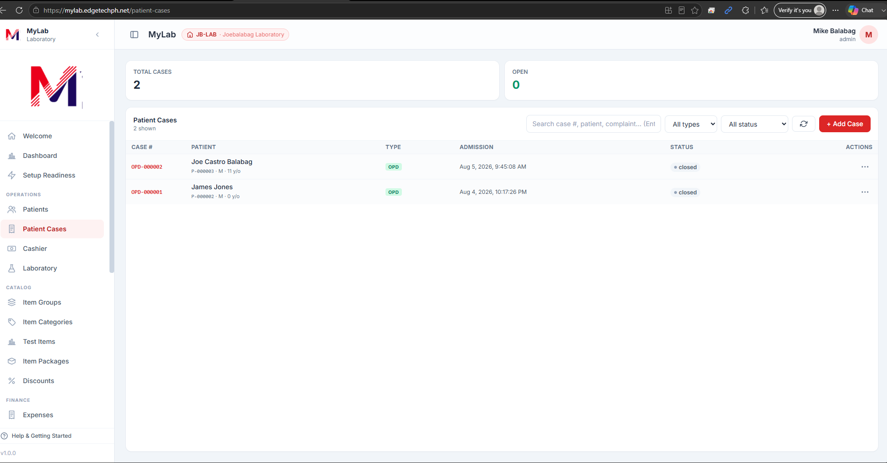

### Step 2. Add Case — search patient first

Click **+ Add Case**. The **Add Case — search patient** modal opens. Type
the patient's **First name** (Last name and Birthdate are optional but
tighten the match). Then either:

- Click **Search** — if the patient already exists, a results row appears
  with a **Use for new case** button.
- Click **Register new patient →** — if you already know they're new (or
  the search returned nothing), jump straight into the register form.

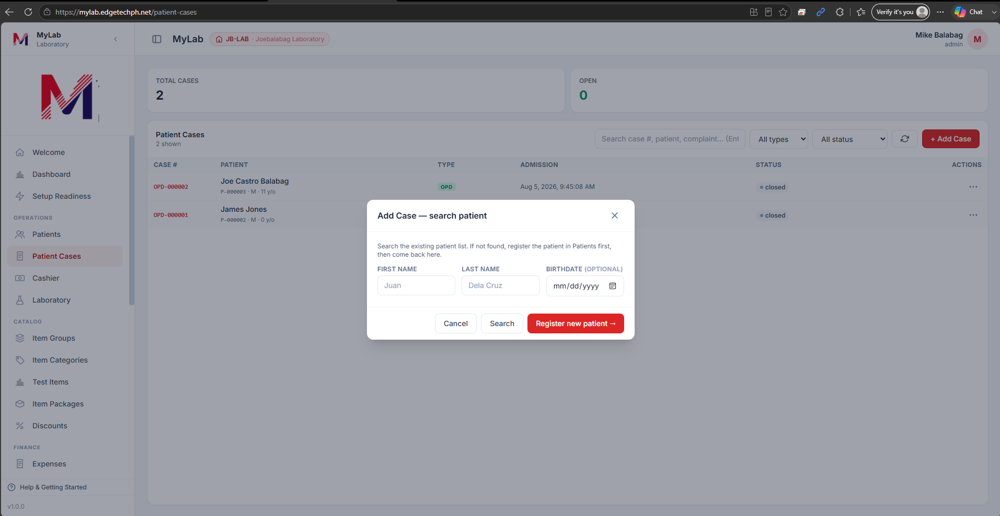

### Step 3. Register Patient & Create Case (new patient path)

Chose to register? The **Register Patient & Create Case** modal opens.
Fill in the **New Patient** block (First / Middle / Last name, Suffix,
Sex, Birthdate, Contact number, Email, Address, City, Province). The MRN
is auto-generated on save.

Below the patient block, fill in **Case Details** — Case Type (defaults
to OPD), Chief Complaint / Reason for Visit, Attending Physician,
Referring Physician, Notes. Click **Register & Create Case** to save
both the patient and the case in one shot.

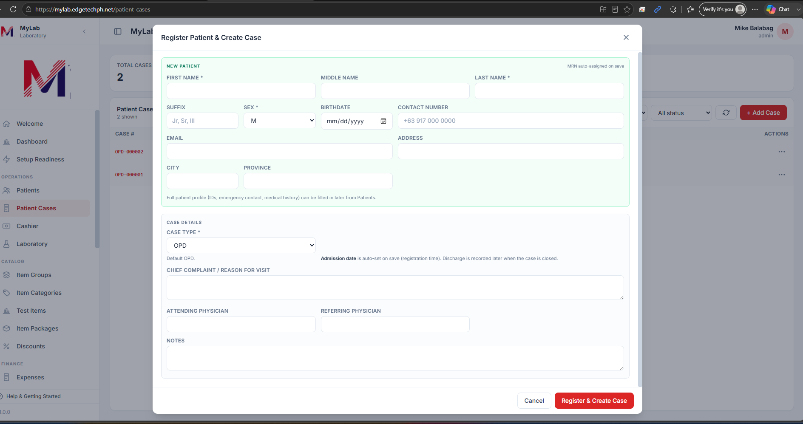

### Step 4. Add Patient Case (existing patient path)

If you picked an existing patient in Step 2, you land on the **Add
Patient Case** modal instead — the identity block at the top is
read-only (MRN, name, age, address, blood type). Fill in the **Case
Details** as above and click **Create case**.

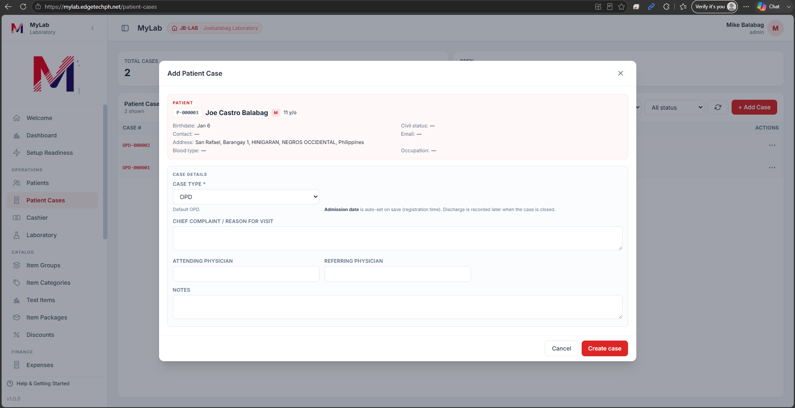

### Step 5. Add a Requisition (Lipid Profile + FBS)

Once the case exists, add the requisition. In the **Add Requisition**
modal:

1. Optionally set **Physician** (referring — prints on the report) and
   **Notes**.
2. Under the **Tests** tab, filter by **All categories** (or narrow to
   Clinical Chemistry) and search — e.g. `fbs` for Fasting Blood Sugar.
3. Click **+ Add** on each row you want. In the screenshot below, both
   **LIP1D Lipid Profile** (₱500.00) and **FBS Fasting Blood Sugar**
   (₱100.00) are already in the **Requested Items** table at the bottom.
4. Adjust the quantity or remove items with the trash icon.
5. Click **Create requisition**.

The requisition is saved as **Unpaid** and appears in the case's
requisition list, ready for the cashier.

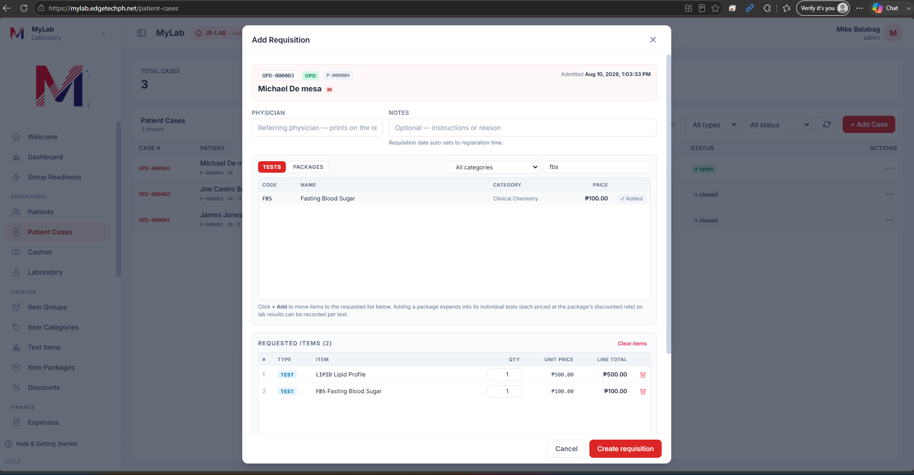

---

## Part 2 — Cashier: Cash Payment

### Step 6. Open the Cashier

Click **Cashier** on the sidebar. The tape defaults to today, so on a
fresh day it opens empty with the **No payments yet** empty state.
Click **+ New Payment** to start a collection.

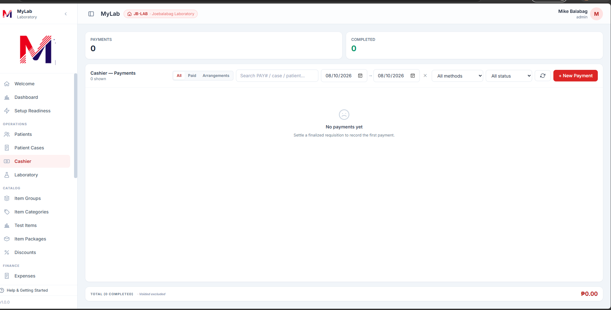

### Step 7. New Payment — pick a case

The **New Payment — pick a case** modal lists every case with unpaid
requisition items. Each row shows the case number, patient, unpaid item
count, and outstanding balance. Search by case #, patient name, or MRN
if the list is long.

Click **Settle** on the case you're collecting for (Michael De mesa,
OPD-000003, ₱600.00 in the screenshot).

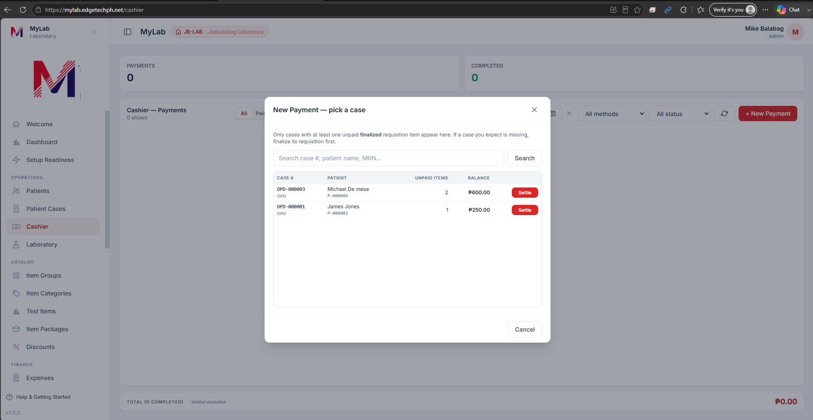

### Step 8. Confirm items, choose Cash, and post

The **New Payment** form loads with all unpaid items pre-selected on the
left and the totals panel on the right.

- **Unpaid items** — Lipid Profile ₱500 + Fasting Blood Sugar ₱100. Leave
  both checked (or uncheck any the patient isn't paying for right now —
  those stay unpaid on the case).
- **Discount** — leave as **Keep quoted line discount** unless a specific
  discount applies.
- **Payment Method** — pick **Cash**.
- **Amount Tendered** — enter the cash on the counter (e.g. `1000`). The
  **Change** panel updates live (₱400.00 in the screenshot for a ₱600 due
  and ₱1000 tendered).
- Optionally note anything in **Notes**.
- Click **Confirm Payment**.

The payment posts as **completed**, the requisition items flip to **Paid**,
and a receipt is available for print.

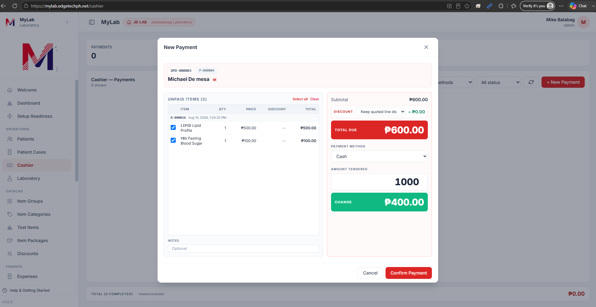

---

## Part 3 — Laboratory: Generate, Encode, Tag as Final

### Step 9. Open the Laboratory module

Click **Laboratory** on the sidebar. The dashboard shows counters for
Total / Drafts / Finalized reports and the list of every lab report,
filterable by group, category, status, and date range. Click
**+ Add Laboratory** at the top-right to create a new report from a paid
requisition.

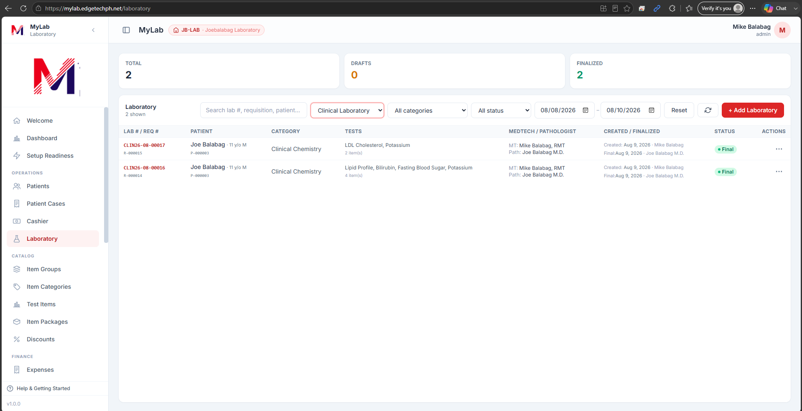

### Step 10. Add Laboratory — Choose Requisition

The **Add Laboratory — Choose Requisition** modal lists every paid
requisition that still has uncovered items (i.e. items not yet attached
to a lab report). Each row shows the requisition #, date, patient, case,
categories, item summary, requested-by user, and uncovered count.

Click **Proceed →** on the requisition you want to generate a report
for (R-000016 for Michael De mesa in the screenshot).

### Step 11. Confirm Groupings

The **Add Laboratory — Confirm Groupings** step shows how the selected
requisition's items will be split into lab reports. The default follows
each item category's **Combine in one print-out** setting — Clinical
Chemistry is combined, so **Lipid Profile** and **Fasting Blood Sugar**
sit under one group.

- Uncheck a test to move it into its own separate report, or uncheck
  every test in a group to skip it entirely.
- The summary line ("Will create **1** lab report.") updates live.

Click **Create 1 report** to generate the draft.

### Step 12. Encode the analyte results

The report editor opens for **Lab Report CLIN26-08-00018** (draft
status). The header carries the patient, requisition, category, and
medtech.

- Set **Specimen Collected At (Time Taken)** if it differs from now.
- For each panel component in the **Lipid Profile** table (Total
  Cholesterol, Triglycerides, HDL, LDL, VLDL, Total/HDL Ratio) type the
  measured value in the **Result** column. Unit and reference range are
  fixed by the test catalog.
- Do the same for the **Fasting Blood Sugar** panel below.
- Add any comments in **Remarks**.
- Click **Save Results** to persist without finalizing (status stays
  **Draft**), or **Tag as Final** to move on to Step 14.

### Step 13. Print Preview (optional check before signing)

From the report row's action menu, choose **Print Preview** to see the
final layout at true paper size. The preview shows the tenant
letterhead, QR code, patient block, **CLINICAL CHEMISTRY** category
banner, the Lipid Profile + FBS tables with your encoded values, and
the medtech / pathologist signature block.

The amber note at the top tells you which paper size the printer will
receive; use the **Configured / Recommended** toggle if the predictor
suggests a larger sheet. Click **Print** to open the isolated print
window.

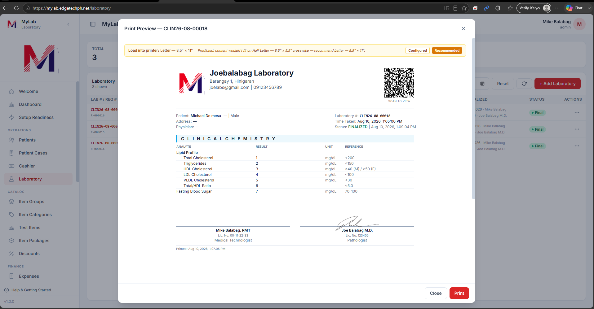

### Step 14. Tag as Final

Back in the report editor (or from the row action menu), click
**Tag as Final**. The **Tag as Final** dialog confirms what's about to
happen — "Finalizing L ({lab-number}) will lock it. You'll need to
reopen (untag) later to issue a corrected version."

Enter the **second-holder signatory** credentials (username + password)
to co-sign the report, then click **Tag as Final**. The report is now:

- Locked from further edits (a manager can Untag as Final to reopen).
- Signed by the medtech + pathologist and dated.
- Watermarked **Final** on every printout.
- Reachable via the QR code on the printed page (public read-only view).

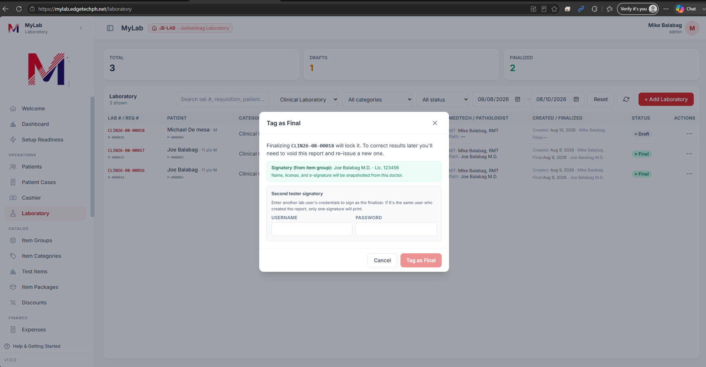

Release the report to the patient — done.

---

## Recap

| # | Where | What happens |
|---|-------|--------------|
| 1–2 | Patient Cases | Search for the patient before creating anything |
| 3   | Register modal | New patient + case in one save |
| 4   | Add Patient Case | Existing patient → case only |
| 5   | Add Requisition | Pick Lipid Profile + FBS → Create requisition |
| 6–8 | Cashier | Pick case → confirm items → Cash + Tendered → Confirm |
| 9–11 | Laboratory | Pick paid requisition → confirm groupings → generate report |
| 12  | Report editor | Encode analyte values, add remarks |
| 13  | Print Preview | Visual check at true paper size |
| 14  | Tag as Final | Second-signatory credentials lock the report |
